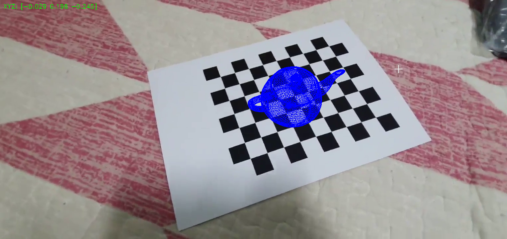

# 3D on Chessboard



Shows 3D teapot above chessboard with pose estimation based on camera calibration data.

## Features

`ESC`: Quit

`Space`: Pause

## Limitations
When part of chessboard becomes invisible, teapot goes invisible and framerates are going down.

## Run

```
pip install -r requirements.txt
python main.py
```
